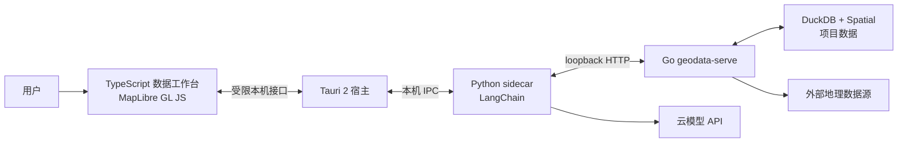

# 初步技术方案

> 状态：初步方案。本文只记录已经确认的技术边界；尚未确认的实现选择会明确列出，不应据此提前实现。

> 更新说明：本文中的 Python sidecar 数据与 DuckDB 职责已被 [数据模块 v1](data-module-v1.md) 和 [ADR-0003](../adr/0003-go-duckdb-geodata-serve.md) 取代。桌面宿主、前端、制图与 Agent 的整体方案不在本轮数据服务设计中重新决定。

## 目标与边界

- 产品是 Windows x64 桌面应用，而非部署到公网的 Web 服务。
- 项目数据、DuckDB 数据库、缓存与导出物持久化在用户机器。
- 产品以数据获取和分析为主，地图用于展示过程与成果。
- 主要交互是数据工作台；地图、图层、数据集和分析结果是主界面，Agent 是嵌入式协作者而非唯一界面。
- 可以调用云模型。项目数据不以应用自建云服务为存储层；模型调用可能传输应用传入的上下文。

## 已确定技术栈

| 层级 | 选择 | 职责 |
| --- | --- | --- |
| 桌面宿主 | Tauri 2 | 承载本地桌面应用、原生权限、文件选择和本机进程生命周期。 |
| 前端 | TypeScript + MapLibre GL JS | 构建数据工作台，并显示地图、图层和分析成果。前端 UI 框架尚未选择。 |
| 数据与空间分析 | Go `geodata-serve` + DuckDB + Spatial | `geodata-serve` 统一拥有 DuckDB 生命周期，并负责项目数据的持久化、并发访问、写前备份与本地空间分析。 |
| Agent 与业务服务 | Python + LangChain 生态 | 编排数据获取、分析和与模型的交互；通过本机 sidecar 进程随应用分发，并经 `geodata-serve` 的 loopback HTTP interface 提交 DuckDB SQL。 |
| 模型 | 云模型 API | 根据 Agent 的需要生成规划、解释或其他模型能力。具体提供商尚未选择。 |

## 本机进程边界

- UI 不能直接获得任意本地文件系统或命令执行权限；文件访问和 sidecar 调用由 Tauri 明确授权。
- Python 服务只在本机与宿主通信，不作为局域网或公网服务暴露。
- `geodata-serve` 仅监听 loopback；每个项目由一个进程统一打开调用方指定的持久化 DuckDB 数据库。
- 数据获取、分析和制图成果都归属于一个项目，并应可定位其输入与产生结果。

## 已确认的发布范围

- v1 仅发布 Windows x64 版本。
- 打包过程必须包含 Python 运行时、`geodata-serve` 以及 DuckDB 与所需空间依赖，最终用户不应需要单独安装 Python、Go 工具链或 DuckDB。
- 其他桌面平台及 ARM 架构在后续版本重新评估。

## 尚未决定

- 前端 UI 框架与组件库。
- Python sidecar 的具体 RPC 协议、打包工具与进程监督细节。
- 云模型提供商、模型选择、提示词与工具调用设计。
- 数据源清单、离线地图／瓦片缓存策略和导出格式。
- Agent 的计划确认、写入和外部请求的权限策略。

## 相关决策与调研

- [ADR-0001：采用 Tauri 与 Python sidecar](../adr/0001-tauri-python-sidecar.md)
- [ADR-0003：采用 Go + DuckDB 的本地 geodata-serve](../adr/0003-go-duckdb-geodata-serve.md)
- [桌面框架选型调研](../research/desktop-frameworks-local-geo-agent-2026.md)
