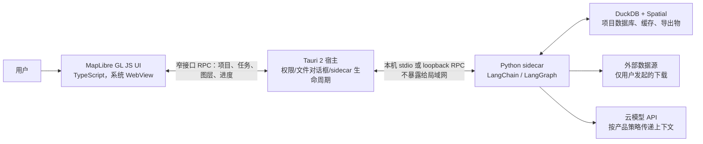

# 本地优先地理数据 Agent 的桌面框架选型（2026）

> **问题**：为一个以数据获取与空间分析为主、以制图展示成果的桌面应用选择外壳。界面使用 MapLibre GL JS；数据、DuckDB（含 Spatial）与项目文件持久化在用户机器；主要 Agent 逻辑预计采用 Python 的 LangChain 生态；允许调用云模型。  
> **调研日期**：2026-07-29（热度数据是当日读取到的快照，而非长期市场份额）。  
> **证据标准**：只采用项目官方文档、官方 GitHub 仓库页面和官方 npm Registry 下载 API。评分与最终建议是基于这些事实的工程判断，明确标为“判断”，不是框架官方承诺。
>
> **后续决定**：本文涉及 Python sidecar 直接拥有 DuckDB 与数据分析的描述已被 [ADR-0003](../adr/0003-go-duckdb-geodata-serve.md) 取代；桌面框架、前端、制图和 Agent 技术栈未由该 ADR 重新决定。

## 结论先行

**首选：Tauri 2 + TypeScript/React（或同类 Web UI）+ MapLibre GL JS，Python Agent/DuckDB 作为随应用打包的 sidecar 进程。**

这不是“前后端部署到两台机器”的前后端分离，而是**一个安装包内的两个本地进程**：WebView 渲染地图与交互；受限的桌面宿主负责文件选择、项目目录、进程生命周期和更新；Python 进程拥有 LangChain、DuckDB Spatial、数据下载与分析任务。Tauri 官方直接支持把任意语言的可执行文件（文档以 PyInstaller 打包的 Python CLI/API 服务为例）作为 `sidecar` 随安装包分发，并要求为每个目标平台/架构提供带 target-triple 的二进制文件。[Tauri：嵌入外部二进制文件](https://v2.tauri.app/develop/sidecar/)

这个选择在“地图 Web UI + Python 分析主栈”之间取得了最好的平衡：地图界面保持浏览器开发体验，Python 不需要被改写为 TypeScript 或 Rust；宿主又能以 capability 明确限制前端可以访问的文件、命令和窗口，而不是把本机能力直接暴露给地图页面。[Tauri capabilities](https://v2.tauri.app/security/capabilities/) [Tauri 文件系统权限](https://v2.tauri.app/plugin/file-system/)

**需要提前接受的代价**：Python sidecar（以及它所携带的 DuckDB、Spatial、GDAL/PROJ 等依赖）需要按 Windows、macOS（Intel/Apple Silicon）和 Linux 目标分别构建、签名和验证；这是 Tauri sidecar 的目标架构命名规则直接带来的发布工作，而非运行时能自动解决的问题。[Tauri：sidecar 的 target triple 规则](https://v2.tauri.app/develop/sidecar/)

若团队更熟悉 Node/Electron，或第一阶段只支持 Windows/macOS、优先降低桌面壳的学习成本，**Electron 是很稳妥的第二选择**。若要让 Python 成为唯一主进程、团队已有成熟 Qt 经验，则改选 **PySide6/Qt**；这牺牲了部分 Web-first 的自然性，但能消除 Python sidecar 的进程与 IPC 边界。

## 建议的本地架构

这是推荐设计，不是框架的固定架构。具体落地时应把 UI 到宿主的接口收窄为如 `open_project`、`run_job`、`cancel_job`、`get_layer_preview` 与 `export`；不要让前端获得“任意路径读写”或“任意 shell 命令”。Tauri 的 capability/插件权限机制正适合逐项授予文件系统与 shell 能力；其 shell sidecar 也必须显式获得 `execute` 或 `spawn` 权限。[Tauri capabilities](https://v2.tauri.app/security/capabilities/) [Tauri sidecar 权限示例](https://v2.tauri.app/develop/sidecar/)

MapLibre GL JS 是浏览器 JavaScript 地图库，因此上述所有 WebView 候选都应先用真实数据做 GPU/矢量瓦片/中文字体的冒烟验证；本报告没有把“能加载 HTML”误写成“所有 WebView 上的地图性能等价”。MapLibre 的官方项目将其定位为 WebGL 地图库，并提供 npm/浏览器用法。[MapLibre GL JS 官方仓库](https://github.com/maplibre/maplibre-gl-js)

## 候选框架的适配性比较

评分为本项目的工程判断：5 表示与既定约束直接匹配，3 表示可行但引入一个明显的主语言或发布边界，1 表示需要改变核心方案。它不代表通用框架排名。

| 框架 | MapLibre Web UI | Python + DuckDB 本地分析 | 文件/进程与安全边界 | 跨平台发布、更新 | 本项目判断 | 关键依据与边界 |
| --- | ---: | ---: | ---: | ---: | --- | --- |
| **Tauri 2** | 5 | 4 | 5 | 4 | **首选** | Web UI 与任意语言 sidecar 有正式路径；capability 可按窗口/WebView 与插件权限授予；官方有文件系统、shell 和 updater 插件。代价是 Python sidecar 要为每个目标构建。[sidecar](https://v2.tauri.app/develop/sidecar/) [capabilities](https://v2.tauri.app/security/capabilities/) [官方插件目录](https://v2.tauri.app/plugin/) [updater](https://v2.tauri.app/plugin/updater/) |
| **Electron** | 5 | 4 | 4 | 4 | **成熟备选** | Electron 将 Chromium 与 Node.js 打入应用，可用单一 JavaScript 代码库覆盖 Windows/macOS/Linux；主进程有 Node 环境，适合启动并监管 Python。安全上必须保持 `contextIsolation`、renderer sandbox，并经窄 IPC 暴露能力；官方内置自动更新在 macOS/Windows 有支持，Linux 需交给发行版包管理器。[Electron 简介](https://www.electronjs.org/docs/latest/) [进程模型](https://www.electronjs.org/docs/latest/tutorial/process-model) [安全清单](https://www.electronjs.org/docs/latest/tutorial/security) [自动更新平台限制](https://www.electronjs.org/docs/latest/api/auto-updater/) |
| **PySide6 / Qt** | 4 | 5 | 4 | 3 | **Python-first 备选** | `QWebEngineView` 可承载网页，`QWebChannel` 可把 Python `QObject` 与页面 JavaScript 通信；因此 MapLibre 可保留，但要自行设计 WebChannel/导航/权限边界。Python、LangChain 与 DuckDB 可以在同一应用进程中；官方提供 `pyside6-deploy`，Qt Installer Framework 可维护在线更新仓库。适合已有 Qt 工程能力、或必须消除 sidecar 的团队。[QWebEngineView](https://doc.qt.io/qtforpython-6/PySide6/QtWebEngineWidgets/QWebEngineView.html) [Qt WebChannel](https://doc.qt.io/qtforpython-6/PySide6/QtWebChannel/index.html) [PySide6 部署](https://doc.qt.io/qtforpython-6/deployment/deployment-pyside6-deploy.html) [Qt Installer Framework](https://doc.qt.io/qtinstallerframework/ifw-overview.html) |
| **Wails** | 4 | 3 | 3 | 3 | **可行，不优先** | Wails 是 Go 宿主 + Web 前端绑定；Windows 使用 WebView2，Linux 依赖 GTK/WebKit，前端会注入其 IPC/runtime。Python 仍需被 Go 启动并封装为外部进程，因此新增 Go 作为第三种主语言；官方文档有代码签名指引，但本次官方资料中没有与 Tauri/Electron 等价的内建 updater 路径。[Wails 前端/绑定](https://wails.io/docs/guides/frontend/) [支持平台与 WebView 依赖](https://wails.io/docs/v2.12.0/gettingstarted/installation/) [Windows WebView2](https://wails.io/docs/next/guides/windows/) [签名](https://wails.io/docs/guides/signing/) |
| **Neutralinojs** | 3 | 4 | 3 | 2 | **轻量 PoC 可选，不作为主线** | 它使用系统 WebView、以 HTTP/WebSocket 提供 native API；扩展可用任意语言实现，故可接 Python，但长任务需要自行维护扩展协议、进程监督和版本兼容。`nativeAllowList`/`nativeBlockList` 可限制 API；其内置更新只替换 `resources.neu`，框架二进制升级仍需重新下载安装，和携带 Python 环境的完整产品更新不够匹配。[Neutralino 架构](https://neutralino.js.org/docs/contributing/architecture/) [扩展](https://neutralino.js.org/docs/how-to/extensions-overview/) [native API 权限](https://neutralino.js.org/docs/api/overview/) [更新限制](https://neutralino.js.org/docs/how-to/auto-updater/) |

### 为什么 Electron 不是默认首选

Electron 的兼容性与生态最强，且嵌入 Chromium 对复杂 WebGL 地图是一个实际优势；但是 Python Agent 仍是独立进程，故它并未消除本项目最关键的 Python 打包问题。相较 Tauri，它还把完整 Chromium 与 Node.js 一同交付；本报告不对体积给出未经目标构建测量的数字，但这种运行时组成是 Electron 官方明确描述的事实。[Electron 简介](https://www.electronjs.org/docs/latest/)

因此，若团队的最大风险是“Web 地图兼容性与桌面工程交付速度”，选 Electron；若最大风险是“本地权限、能力最小化与不想在产品中把 Node 作为后端主栈”，选 Tauri。两者都不应让 renderer 直接运行 Python 或拥有裸露的文件系统能力；Electron 官方也明确要求 remote content 不得开启 Node integration，并建议上下文隔离、sandbox 和 IPC sender 校验。[Electron 安全指南](https://www.electronjs.org/docs/latest/tutorial/security)

### 为什么 PySide6/Qt 不是默认首选

PySide6 是唯一一个让预期的 Python Agent、DuckDB 客户端和桌面宿主自然处于同一语言/运行时的候选，因而在分析任务编排、调试器与打包依赖定位上有明显优势。`QWebEngineView` 是可加载网页的 Qt widget，故它不是“不能使用 MapLibre”的方案。[QWebEngineView](https://doc.qt.io/qtforpython-6/PySide6/QtWebEngineWidgets/QWebEngineView.html)

但产品的主体验被定义为 MapLibre GL JS 的 Web 地图与数据工作台，而不是 Qt Widgets/QML 原生界面。选择 PySide6 等于自己维护 WebEngine 的页面加载、JS-Python bridge、CSP/导航策略和桌面壳交互；Tauri/Electron 则把 Web 前端作为一等模型。除非 Python 单进程是强约束，或已有 Qt 团队与发布基础设施，否则这笔复杂度不值得默认承担。这是架构取舍，不是 Qt 能力缺失。

### 为什么不建议 Flutter

Flutter 很热门，但它是 Dart UI 工具包；若坚持 MapLibre **GL JS**（而非改用另一个 Flutter 地图库），需要把 JS 地图放入 WebView 并再维护 Dart 与 JavaScript 的桥接。Flutter 官方把 WebView 作为插件路径提供，恰好说明这会引入额外宿主/桥接层；再叠加 Python Agent，应用会同时拥有 Dart、JavaScript 和 Python 三个主语言边界。[Flutter 官方 WebView cookbook](https://docs.flutter.dev/cookbook/plugins/webview) [MapLibre GL JS 官方仓库](https://github.com/maplibre/maplibre-gl-js)

只有在未来把移动端离线采集、原生相机/GNSS 和 iOS/Android 成为一等目标时，才建议重新把 Flutter 纳入短名单；那时应连同“是否放弃 MapLibre GL JS、改用原生地图 SDK”一起重做选型。

## 热度、生态与维护信号

### 指标口径

- GitHub star/fork 是开发者关注度快照，不等于活跃用户、商业部署量或安全性。
- 对有 npm 包的 Web 框架，补充使用官方 npm 下载 API 的过去 30 天下载量；它也不等于独立应用数，且包的间接依赖会抬高数值。
- Wails 是 Go 项目、PySide6 主要经 PyPI/Qt 分发，和 npm 指标不可横向相加；Flutter 更不应因总体热度而覆盖本项目的技术不匹配。故下表只展示可从同一官方来源复核的指标，不伪造“市场份额”。

| 项目主仓库 | GitHub stars / forks（2026-07-29） | 可比的官方包下载快照 | 对本项目的解读 |
| --- | ---: | --- | --- |
| [Electron](https://github.com/electron/electron) | 122,222 / 17,362 | [`electron` 19,639,859 次，2026-06-25 至 07-24](https://api.npmjs.org/downloads/point/2026-06-25:2026-07-24/electron) | 最大的 JS 桌面生态与故障排查样本；仍须遵守其安全模型。 |
| [Tauri](https://github.com/tauri-apps/tauri) | 109,633 / 3,811 | [`@tauri-apps/api` 8,204,733 次，同一期间](https://api.npmjs.org/downloads/point/2026-06-25:2026-07-24/%40tauri-apps%2Fapi) | 热度和 JS 使用量已足以支撑主线选择；其 Rust/sidecar 发布链需在 PoC 中验证。 |
| [Wails](https://github.com/wailsapp/wails) | 35,574 / 1,783 | 不适用（Go 分发） | 社区可观，但 Go 对本项目是新增主语言。 |
| [Neutralinojs](https://github.com/neutralinojs/neutralinojs) | 8,600 / 524 | [`@neutralinojs/neu` 12,090 次，同一期间](https://api.npmjs.org/downloads/point/2026-06-25:2026-07-24/%40neutralinojs%2Fneu) | 生态明显更小；应把它限定为轻量原型的风险验证。 |
| PySide6/Qt | 不用 `pyside-setup` 的 GitHub star 代表 Qt/PyPI 生态 | 无可与 npm 同口径的官方 PyPI 历史下载 API | 以 Qt 官方文档、支持周期及团队既有经验判断，不以失真的 star 排名。 |
| [Flutter](https://github.com/flutter/flutter) | 177,962 / 30,823 | 不与上述 npm 包比较 | 总体热度很高，但不能抵消 MapLibre GL JS + Python 所带来的双桥接成本。 |

仓库数值来自各仓库页面显示的 star/fork；下载数字来自表中链接的 npm 官方 API，期间和包名已写在链接中。Wails 与 Neutralino 的官方文档在调研日仍提供当前平台、构建或框架发布说明；这只能说明项目仍有公开维护面，不能从中推出 SLA 或未来 API 稳定性。[Wails 安装/平台文档](https://wails.io/docs/v2.12.0/gettingstarted/installation/) [Neutralino release notes](https://neutralino.js.org/docs/release-notes/framework/)

## 选择后的最小验证计划

在正式定框架前，先用 **Tauri 2 主方案**做一个 1--2 周的垂直 PoC；不需要先实现多 Agent 或完整数据市场。

1. **打包验证**：把最小 Python 服务打成 Tauri sidecar，在目标 Windows x64 上启动、取消、崩溃重启；服务中执行 `LOAD spatial`、读一个 GeoParquet/GeoJSON、向 DuckDB 写本地项目库。验收：不要求终端预装 Python，关闭应用后无残留进程。
2. **真实地图验证**：加载真实矢量图层、百万级要素的聚合结果和大于 100 MB 的本地导出；在 WebView 中测首屏、平移缩放、GPU 回退和内存，不以简单 marker demo 代替。
3. **权限验证**：文件对话框只授权用户选中的项目目录；试图从 UI 传入 `..`、非项目目录、任意命令、非白名单 sidecar 时必须被拒绝。Tauri 的文件系统 scope 与 sidecar permissions 提供了可测试的实现基础。[Tauri 文件系统 scope](https://v2.tauri.app/plugin/file-system/) [Tauri sidecar permissions](https://v2.tauri.app/develop/sidecar/)
4. **更新与迁移验证**：对壳、Python sidecar、DuckDB 扩展和项目 schema 分别定义版本号；做一次旧项目升级与失败回滚演练。Tauri 的 updater 是可用组件，但不能替代对本地数据库迁移的事务与备份设计。[Tauri updater](https://v2.tauri.app/plugin/updater/)

PoC 的淘汰条件应预先写死：若目标设备上的系统 WebView 无法稳定运行真实 MapLibre 工作负载，或 Python/Spatial 的跨平台打包成本超出发布能力，则切换到 Electron（优先保证 WebGL 一致性）或 PySide6（优先消除 Python sidecar），而不是在主线中同时保留三套壳。

## 尚待产品决定的边界

1. **平台优先级**：第一版是否只支持 Windows x64/ARM64。若是，Tauri sidecar 的发布矩阵可显著缩小；若三桌面平台同发，应从第一天就在 CI 中构建/签名每个目标。
2. **“本地数据”是否包括底图与瓦片缓存**：MapLibre 使用的远程瓦片、地名服务、地理编码和数据下载都可能产生网络访问；需单独定义默认源、缓存目录、离线包与用户可见的网络日志。
3. **模型数据边界**：本次约束允许云模型看到数据，但仍应明确模型调用记录、提示词、原始要素和令牌是否写入本地项目，以及可否一键清除。
4. **更新信任链**：所有桌面壳都需要代码签名；sidecar、模型工具和 DuckDB 扩展应使用锁定版本及校验，而不能在用户机器上静默下载任意可执行文件。

## 一手来源索引

- [Tauri 2：外部二进制 / sidecar](https://v2.tauri.app/develop/sidecar/)、[capabilities](https://v2.tauri.app/security/capabilities/)、[插件目录](https://v2.tauri.app/plugin/)、[文件系统](https://v2.tauri.app/plugin/file-system/)、[updater](https://v2.tauri.app/plugin/updater/)
- [Electron：简介](https://www.electronjs.org/docs/latest/)、[进程模型](https://www.electronjs.org/docs/latest/tutorial/process-model)、[安全](https://www.electronjs.org/docs/latest/tutorial/security)、[更新](https://www.electronjs.org/docs/latest/tutorial/updates)
- [Neutralino：简介](https://neutralino.js.org/docs/)、[架构](https://neutralino.js.org/docs/contributing/architecture/)、[扩展](https://neutralino.js.org/docs/how-to/extensions-overview/)、[更新](https://neutralino.js.org/docs/how-to/auto-updater/)
- [Wails：安装与平台](https://wails.io/docs/v2.12.0/gettingstarted/installation/)、[前端](https://wails.io/docs/guides/frontend/)、[签名](https://wails.io/docs/guides/signing/)
- [Qt for Python：QWebEngineView](https://doc.qt.io/qtforpython-6/PySide6/QtWebEngineWidgets/QWebEngineView.html)、[QWebChannel](https://doc.qt.io/qtforpython-6/PySide6/QtWebChannel/index.html)、[部署](https://doc.qt.io/qtforpython-6/deployment/deployment-pyside6-deploy.html)、[Installer Framework](https://doc.qt.io/qtinstallerframework/ifw-overview.html)
- [MapLibre GL JS 官方仓库](https://github.com/maplibre/maplibre-gl-js)、[Flutter WebView 官方 cookbook](https://docs.flutter.dev/cookbook/plugins/webview)
- [npm 官方下载 API：Electron](https://api.npmjs.org/downloads/point/2026-06-25:2026-07-24/electron)、[Tauri API](https://api.npmjs.org/downloads/point/2026-06-25:2026-07-24/%40tauri-apps%2Fapi)、[Neutralino CLI](https://api.npmjs.org/downloads/point/2026-06-25:2026-07-24/%40neutralinojs%2Fneu)
