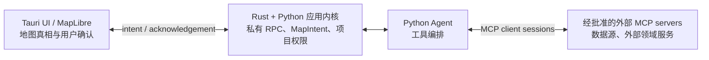

# MCP 在本地地理数据 Agent 中的位置

> **问题**：对于 Tauri + Python Agent + MapLibre GL JS 的本地桌面应用，Agent 的地图/数据能力是否应使用 MCP？若使用，MCP 应放在哪一层？
>
> **调研日期**：2026-07-30。
>
> **证据标准**：下文“已验证事实”只引用 MCP 和 MapLibre GL JS 的一手规范/官方 API；“项目建议”是针对本项目边界的工程判断。
>
> **后续决定**：本文涉及 Python 直接拥有 DuckDB 与数据分析的描述已被 [ADR-0003](../adr/0003-go-duckdb-geodata-serve.md) 取代；MCP 与地图交互结论保留为当时的研究背景。

## 结论先行

**v1 不应把 MCP 放在 Python Agent 与 MapLibre UI 之间，也不应为了内部工具把 Python sidecar 再包装成一个本机 MCP server。** 此处采用已有的 Tauri ↔ Python 私有 RPC，加一个受版本约束的 `MapIntent` 契约即可。

MCP 的合适位置是**可插拔的外部能力边界**：Python Agent 作为 MCP host/client，按用户批准连接外部数据、领域服务或未来第三方工具；Tauri UI/Rust 保留连接许可、凭据呈现、用户确认与实际桌面副作用的门控。若将来要把项目能力提供给其他 AI 宿主，再另行提供一个默认只读、显式启用的 project MCP server。MCP 的 host/client/server 架构本来就把连接生命周期、授权和上下文聚合置于 host，而每个 client 与一个 server 维持隔离的有状态连接。[MCP Architecture](https://modelcontextprotocol.io/specification/2025-11-25/architecture)



## 已验证事实

1. MCP 是 host-client-server 的有状态 JSON-RPC 协议：host 创建并管理多个 client，client 与一个 server 一对一连接并负责协商、订阅和通知；server 可以是本地进程或远程服务。初始化必须先协商协议版本与 capability，正常操作前 client 还要发送 `notifications/initialized`。[MCP Architecture](https://modelcontextprotocol.io/specification/2025-11-25/architecture) [MCP Lifecycle](https://modelcontextprotocol.io/specification/2025-11-25/basic/lifecycle)

2. MCP tool 面向模型控制：server 以名称、说明和 JSON Schema 暴露工具，client 通过 `tools/list` 发现、通过 `tools/call` 调用；工具可提供 `structuredContent` 和 output schema。规范建议人始终可拒绝调用、UI 明示工具暴露与调用；server 必须校验输入并实施访问控制，client 应在敏感操作前确认、记录审计并设置超时。[MCP Tools](https://modelcontextprotocol.io/specification/2025-11-25/server/tools)

3. MCP 标准传输只有 stdio 和 Streamable HTTP。stdio 要求 client 启动子进程、每个 JSON-RPC 消息单行、stdout 只能写协议消息，日志写 stderr；Streamable HTTP 则要求 Origin 校验、localhost 绑定和认证，否则可能被 DNS rebinding 攻击。也就是说，MCP 可复用本地 stdio，但不会消除 host 的进程/权限治理工作。[MCP Transports](https://modelcontextprotocol.io/specification/2025-11-25/basic/transports)

4. MCP 支持可选的 `notifications/progress` 和 `notifications/cancelled`；进度 token 只关联活动请求，取消是有竞争条件的 notification。2025-11-25 的 task 扩展仍属 experimental，才提供可持久查询、取消与终态的任务模型。因此应用自身长期分析任务仍须有独立、持久的 `job_id` 与状态记录，不能仅依赖 MCP notification。[MCP Progress](https://modelcontextprotocol.io/specification/2025-11-25/basic/utilities/progress) [MCP Cancellation](https://modelcontextprotocol.io/specification/2025-11-25/basic/utilities/cancellation) [MCP Tasks](https://modelcontextprotocol.io/specification/2025-11-25/basic/utilities/tasks)

5. MapLibre 的 map instance 提供命令式地图操作（如 `addSource`、`addLayer`、`setFilter`、`setPaintProperty`、`setLayoutProperty`、`setStyle`）和状态读取（如 `getStyle`、`getBounds`、`getZoom`、`queryRenderedFeatures`）。`setStyle` 同步返回 map instance、样式加载却是异步的；`style.load` 是重放业务图层的时点，`idle` 表示最后一帧已渲染、当前瓦片已加载且没有相机/淡入过渡。`isStyleLoaded()`、`isSourceLoaded()` 和 `areTilesLoaded()` 可确认不同粒度的就绪状态，不能以函数调用返回当作渲染完成。[Map API](https://maplibre.org/maplibre-gl-js/docs/API/classes/Map/) [Map event types](https://maplibre.org/maplibre-gl-js/docs/API/type-aliases/MapEventType/)

6. MapLibre 的 GeoJSON source 能接收对象或 URL；官方建议大型 GeoJSON 使用 URL，并建议缩减、分块、流式加载或矢量瓦片。这进一步说明 MCP tool result 或聊天上下文不应承载完整图层数据。[MapLibre large-data guide](https://maplibre.org/maplibre-gl-js/docs/guides/large-data/) [GeoJSONSource](https://maplibre.org/maplibre-gl-js/docs/API/classes/GeoJSONSource/)

## 项目建议

### 内部地图能力：契约优先，非 MCP 优先

Python 中实现一组内部的、类型化的 Agent tools；它们通过已有私有 RPC 提交**声明式地图意图**，不能让模型直接调用 MapLibre 的命令式 API，也不能让模型传入任意 JavaScript、样式 URL、文件路径或 SQL。

最小的 `MapIntent` 可为：

```json
{
  "intent_id": "uuid",
  "project_id": "…",
  "base_revision": 17,
  "kind": "add_result_layer | set_view | set_filter | highlight | remove_layer",
  "target": { "dataset_id": "…", "result_id": "…", "layer_id": "…" },
  "render": { "style_key": "…", "field_allowlist": ["…"] },
  "persistence": "ephemeral | project",
  "confirmation": "none | required"
}
```

`intent_id` 让 UI acknowledgement 可追踪；`base_revision` 防止 Agent 把过期计划覆盖用户刚做的地图操作；`target` 只引用项目内稳定 ID；`kind` 与 `style_key` 是白名单。若未来经 MCP 暴露此类工具，以上对象正好可成为 tool 的 input/output JSON Schema 和 `structuredContent`，但这不是在 v1 引入 MCP 的理由。

### 读与写要分开，写入必须有可见确认

- **只读 Agent tools**：`project.describe`、`dataset.list`、`layer.describe`、`map.snapshot`、`map.query_visible_features`、`analysis.result_summary`。返回边界、缩放级别、已见图层/选择、字段白名单、要素摘要和 project/map revision，绝不返回整层 GeoJSON。
- **候选写入 tools**：`analysis.run`、`dataset.import`、`map.propose_intent`、`layer.save_style`、`project.export`。先返回计划、影响范围和将要发生的网络/磁盘/项目修改；UI 显示后由用户批准，再以一次性批准 ID 执行。
- **可免确认的临时视觉效果**仅限用户刚明确要求的、可撤销且可见的 `highlight`/临时视图建议；其 UI 仍显示“Agent 已添加临时图层”。任何持久图层、样式、项目数据、外部下载或导出一律确认。

这也吻合 MCP 对模型控制工具的“人可拒绝、显示输入与调用”的要求；MCP 的 confirmation 规则不能由协议替代，仍由本应用 UI 执行。[MCP Tools: User Interaction and Security](https://modelcontextprotocol.io/specification/2025-11-25/server/tools)

### UI acknowledgement 是地图事实的唯一回执

流程应为：Agent 提出 `MapIntent` → UI 根据确认策略批准/拒绝 → UI 用受控 MapLibre 调用应用 → UI 在相应 style/source 事件或 `idle` 后发出 `MapIntentAck`。ack 至少包括 `intent_id`、`status: applied|declined|failed|superseded`、`map_revision`、实际 layer/source ID 和失败原因。Agent 只能在收到 `applied` 后把“地图已更新”写入对话或进行依赖后续步骤；超时、拒绝或 map revision 冲突必须诚实呈现而非假定成功。

ack 必须标明级别，避免把不同事实混为一句“已显示”：`accepted`（Map API 已接受操作）、`source_ready`（目标 source 已加载）、`style_ready`（当前 style 已加载并可重放图层）、`viewport_stable`（收到 `idle`）。`setStyle` 后 UI 应以 style epoch 和可重放的 LayerRegistry 防止旧样式回调向新样式写入；移除 source/layer 时按“先 layer、后 source”的顺序并用 `getLayer`/`getSource` 保证幂等。[Map API](https://maplibre.org/maplibre-gl-js/docs/API/classes/Map/) [Map event types](https://maplibre.org/maplibre-gl-js/docs/API/type-aliases/MapEventType/)

不要把高频 `move`、鼠标位置或逐要素 source event 原样送给 Agent。UI 应在 `moveend`、选择变化、任务完成等语义边界生成经节流、字段裁剪的 `MapSnapshot`；MapLibre 的 `queryRenderedFeatures` 用于当前可见要素查询，而不是数据仓库的替代品。[Map API](https://maplibre.org/maplibre-gl-js/docs/API/classes/Map/)

### 区分持久项目状态和临时地图状态

| 状态 | 所有者与存储 | Agent 使用方式 |
| --- | --- | --- |
| 项目数据集、分析结果、已保存的图层定义/样式、版本 | Python + DuckDB/项目文件；事务写入并递增 `project_revision` | 通过数据/分析工具读取；写入走确认和持久化命令。 |
| 当前视口、缩放、悬停、选择、临时 highlight、加载中瓦片 | UI/MapLibre 运行时；进程级临时状态 | 只接收受限快照；以 `MapIntent` 建议变化；关闭即丢失。 |
| 是否保存当前视图/筛选为项目默认值 | 明确的用户命令，才从 UI 状态写入项目状态 | 不从普通移动或 Agent 临时层自动升级为持久状态。 |

应用启动时，UI 从项目的持久模型重建 MapLibre 运行时状态；运行时状态不是 Agent、MCP session 或 MapLibre 内存对象的持久化替身。

## 直接内部工具与 MCP 的取舍

| 选择 | 收益 | 本项目判断 |
| --- | --- | --- |
| **内部 Python tools + 私有 RPC + MapIntent** | 无额外 client/server 生命周期、tool discovery、传输/认证栈；模型和 UI 均由同一产品控制，能直接实现 revision、确认与项目事务。 | **v1 默认。** |
| **Python Agent 作为 MCP client，连外部 server** | 标准化 schemas、发现、隔离 session 与第三方能力复用；适合外部数据/服务集成。 | **按需引入。** 每个 server 显式安装、批准、最小权限与审计；stdio 优先，HTTP 依 MCP 安全要求治理。 |
| **把 UI/MapLibre 变成 Agent 的 MCP server** | 若未来存在多个独立 AI host，可能获得跨 host 互操作。 | **现在不做。** MapLibre 是 UI 运行时而非独立领域服务；会平白加入 session、工具暴露和授权面，仍无法替代 UI acknowledgement。 |
| **把完整项目 MCP server 暴露给外部宿主** | 便于其他 AI 客户端使用项目只读摘要。 | **以后单独立项。** 默认只读、项目选择/关闭即撤销、导出受限；写工具必须另加明确授权。 |

## 落地前需验证的事项

1. 做一个从 `map.propose_intent` 到 `MapIntentAck` 的垂直切片：用户在期间手动改变图层时，过期 revision 必须被拒绝或重规划。
2. 针对每一种写工具演练批准、拒绝、超时、MapLibre source/style 失败和 Python 任务取消，确认 Agent 不把“已提议”描述成“已执行”。
3. 若接入第一个外部 MCP server，单独测试其 stdio/HTTP 生命周期、工具清单变化、凭据存储、日志脱敏、上下文最小化与断开清理；不要复用项目 sidecar 的无限文件/数据库权限。
4. 用真实大图层验证 `MapSnapshot`、可视要素查询和图层预览的大小上限；大数据继续留在 DuckDB/受限数据面，而非 MCP/tool result。
