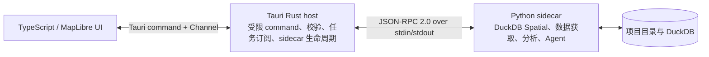

# Tauri 与 Python sidecar 的本机通信方案

> 后续决定：本文涉及 Python sidecar 直接拥有 DuckDB 与数据分析的描述已被 [ADR-0003](../adr/0003-go-duckdb-geodata-serve.md) 取代；Tauri 与 Python 本机通信结论保留为当时的研究背景。

> **问题**：本项目已确定使用 Tauri 2 桌面宿主、TypeScript + MapLibre GL JS 前端及 Python + DuckDB Spatial 业务进程。前端、宿主与 Python 应如何通信，才能同时支持长任务、取消、进度和大地理数据？
>
> **调研日期**：2026-07-29。
>
> **证据标准**：以下“已验证事实”仅引用 Tauri、JSON-RPC、LSP、MapLibre 的官方文档或规范；“项目建议”是基于这些事实的工程判断，不是任一框架的强制要求。

## 结论先行

采用两段本机通信，并把 Rust 宿主作为唯一的权限与进程边界：



这里的“前后端”是同一安装包内的 WebView 与本机业务进程，不是两个可独立部署的网络服务。Tauri 官方支持由 Rust 启动 sidecar、读其 stdout、写其 stdin；但 **JSON-RPC、stdio 帧格式及 UI 不直连 Python 都是本项目的设计选择**，不是 Tauri 的唯一规定。[Tauri：嵌入外部二进制](https://v2.tauri.app/develop/sidecar/)

## 已验证事实

1. Tauri command 是 UI 调用 Rust 的请求/响应接口：参数与返回值经 serde 序列化，支持异步和 `Result` 错误；普通返回值会序列化为 JSON。官方明确指出，大文件或大响应走普通 command JSON 可能变慢，二进制可用 `tauri::ipc::Response`，连续流式数据建议用 Channel。[Calling Rust from the Frontend](https://v2.tauri.app/develop/calling-rust/)

2. Tauri event 没有强类型，负载总是 JSON 字符串，并且不能按 capability 细粒度控制事件数据；官方因此不建议用 event 承载大消息。Channel 适合连续且有序的数据流，例如下载进度、子进程输出和 WebSocket 消息。[Calling the Frontend from Rust](https://v2.tauri.app/develop/calling-frontend/)

3. capability 可以把权限授予指定窗口/WebView，多个 capability 会合并权限；它能降低前端被攻陷时接触系统接口的影响，但不能修复过宽的 scope 或 Rust command 内部漏掉的校验。已注册的应用 command 默认可被所有窗口调用，因此仍需要最小 command 面和按窗口限制。[Tauri capabilities](https://v2.tauri.app/security/capabilities/)

4. Tauri 允许 UI 直接启动 sidecar，但需要授予 `shell:allow-execute` 或 `shell:allow-spawn`；同样的 sidecar 可由 Rust 用 `app.shell().sidecar(name).spawn()` 启动，并处理 stdin/stdout。后者使 UI 无须取得子进程启动权限。[Tauri sidecar](https://v2.tauri.app/develop/sidecar/)

5. JSON-RPC 2.0 与传输无关，定义请求、响应、ID 关联、错误和 notification；它**没有**定义 stdio 的分帧、任务取消或进度。notification 没有 `id` 且不能确认，普通请求必须以同一 ID 返回 `result` 或 `error`。[JSON-RPC 2.0 specification](https://www.jsonrpc.org/specification)

6. LSP 是独立进程走 JSON-RPC 的成熟先例：它用 `Content-Length` 为字节流分帧，并把 `$/cancelRequest` 与 `$/progress` 定义为协议扩展；被取消的请求仍须最终返回。它可作为机制参考，但本项目不是 LSP，不应未经约定地假设 Python 库支持这些扩展。[LSP 3.17 specification](https://github.com/Microsoft/language-server-protocol/blob/gh-pages/_specifications/lsp/3.17/specification.md)

7. MapLibre 的 GeoJSON source 可接收对象或 URL，但其官方文档建议大型 GeoJSON 以 URL 加载，并建议采用数据缩减、分块、流式加载或矢量瓦片；这与将完整数据集塞进 command/event JSON 相冲突。[MapLibre：大型数据指南](https://maplibre.org/maplibre-gl-js/docs/guides/large-data/) [GeoJSONSource API](https://maplibre.org/maplibre-gl-js/docs/API/classes/GeoJSONSource/)

8. Tauri 对生产用 localhost server 提示有“considerable security risks”；默认 custom protocol 是其推荐的替代路径之一。loopback HTTP 并非不能使用，但会额外引入监听地址/端口、来源限制、认证令牌、CORS、CSP 和生命周期治理。[Tauri localhost plugin](https://v2.tauri.app/plugin/localhost/) [Tauri CSP](https://v2.tauri.app/security/csp/)

## 项目建议与原因

### 1. UI 只调用窄的 Tauri command；不授予 shell/sidecar 权限

UI 的接口限定为业务动词，例如 `open_project`、`run_job`、`cancel_job`、`get_job`、`get_layer_preview`、`export_result`。Rust 在 command 内校验数据类型、项目归属、允许的输出位置和操作状态，随后才向固定的 Python sidecar 转发。

这样做的核心不是“多一层更安全”的口号，而是把三个不同职责放在唯一位置：

- **权限**：WebView 不拥有任意路径、任意命令或进程启动能力；Python 也不需要对 UI 开放监听端口。
- **生命周期**：Rust 负责启动一次、握手、崩溃检测、关闭时终止及必要的重启；UI 刷新或重新挂载不会产生额外 Python 进程。
- **适配**：UI 的接口是面向产品的稳定 DTO；Python 内部的 LangChain、DuckDB 或包结构变化不会泄漏到前端。

Tauri command 本身不是可信输入的替代品：所有参数仍要在 Rust 和 Python 两端各自校验；capability 是最小授权的第二道边界，而非绕过业务校验的理由。

### 2. Rust ↔ Python 用单一、受父进程拥有的 stdio 通道

建议 Python 只接受父进程持有的 stdin，并只向 stdout 写协议帧；日志、诊断和第三方库输出一律重定向到 stderr 或文件。每条消息采用 JSON-RPC 2.0 对象，并采用 LSP 风格 `Content-Length` framing，而不是依赖“每行恰好是一段 JSON”。这是因为 stdin/stdout 是字节流，JSON-RPC 本身不提供分帧；`Content-Length` 可表达任意 JSON 负载并有成熟先例。

建议在启动后立刻运行 `initialize`/`health` 握手，协商 `protocol_version`、sidecar 版本和能力；不匹配时拒绝后续任务并显示可诊断的升级错误。协议方法名使用领域前缀，如 `project.open`、`job.start`、`job.cancel`、`layer.preview`，而不要暴露通用的 `sql.execute`、`path.read` 或 `shell.run`。

### 3. 任务与 RPC 请求分开建模

`job.start` 的 JSON-RPC response 只确认受理并返回稳定的 `job_id`；耗时工作在 Python 任务执行器中继续。JSON-RPC `id` 仅关联一次 RPC 请求，不能替代可持久化、可查询、可取消的业务任务标识。

建议的最小状态模型：

```text
queued → running → succeeded | failed | cancelled
```

每个状态事件带 `job_id`、`sequence`、`stage`、可选 `percent`、`message` 和可引用的 `result_id`/错误码。Python 把 `job.progress` 作为 notification 发给 Rust；Rust 将其转入该任务订阅的 Tauri Channel。UI 重连或遗漏 notification 时，以 `get_job(job_id)` 返回的快照为准，不能把 notification 当成唯一事实来源。

取消使用**领域方法** `job.cancel(job_id)`：Rust 先确认请求被受理，Python 在可中断边界检查取消标记、停止后续网络/分析步骤并最终写入 `cancelled`。不要把“用户点击取消”误报为“计算已经停止”。若以后需要按 JSON-RPC request ID 取消，可借鉴 LSP 的扩展语义，但需在本项目协议中显式定义并测试“取消后仍有最终结果/错误”。

### 4. 控制面与数据面分离

IPC 的控制面只传参数、ID、元数据、任务状态、统计摘要和小型预览；DuckDB、原始数据、导出物与中间成果始终留在项目目录。这样既避免 Tauri 的 JSON 序列化瓶颈，也不会在 UI 内存中复制整份地理数据。

v1 的地图显示可以先限定为“视口裁剪、字段白名单、几何简化并设上限”的 GeoJSON 预览，必要时用 `Response` 的二进制路径读取受限产物。若真实工作负载证明需要整层大数据渲染，应另立决策：在受限项目目录上提供只读 asset/custom protocol，或采用带一次性认证的 loopback 矢量瓦片服务；不能把“完整 GeoJSON 经 command/event 传给 UI”当作过渡方案。前一种保留 Tauri 的文件 scope，后一种则必须明确 HTTP 的认证、CORS/CSP、随机端口、绑定 `127.0.0.1` 和退出清理策略。

## 与直接连接/loopback HTTP 的取舍

| 方案 | 适合之处 | 本项目 v1 的代价与结论 |
| --- | --- | --- |
| **UI → Rust command/Channel → Python stdio** | 单安装包、单用户、本地优先；权限和生命周期集中。 | 需实现 RPC framing 与转发，但接口小且边界清楚。**推荐。** |
| UI 直接启动并读写 Python sidecar | 原型少写一层 Rust 转发。 | UI 必须获 shell sidecar 权限；生命周期、路径校验和协议稳定性散落在前端。**不采用。** |
| UI → Python loopback HTTP | Python 的 HTTP/瓦片生态成熟，适合未来高吞吐瓦片。 | 新增端口、鉴权、CORS/CSP、端口冲突与退出清理；Tauri 官方提示生产 localhost server 有显著风险。**不是 v1 默认，作为大图层 PoC 的备选。** |

## 落地前的验证清单

1. 用打包后的 Windows x64 sidecar 做一次启动、握手、崩溃、重启和关闭清理测试；确认 stdout 没有非协议日志。
2. 对每个 command 测试越权项目路径、`..`、未知任务/图层 ID 和非法状态迁移，确认 Rust 与 Python 都拒绝。
3. 用真实大图层验证：任务开始/取消、进度丢失后的状态恢复、预览上限、UI 内存及地图拖拽；若预览不足，再评估数据面方案。
4. 为 JSON-RPC 帧、DTO 版本、状态迁移和取消边界建立跨 Rust/Python 的契约测试；把外部模型、下载和 DuckDB 写入的不可逆步骤放在可审计的 `stage` 中。

## 待决定事项

- v1 的地图预览上限（要素数、字节数、字段、简化误差）及超限时的交互提示。
- sidecar 崩溃后：仅提示重试，还是自动重启并恢复可重试任务。
- 是否为将来的 MVT/整层渲染预留只读 custom protocol；在没有真实负载压测前不引入 loopback HTTP。
